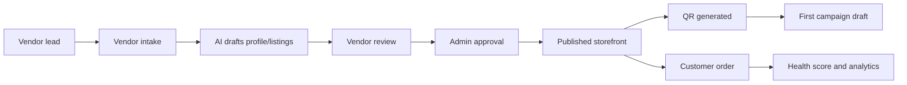
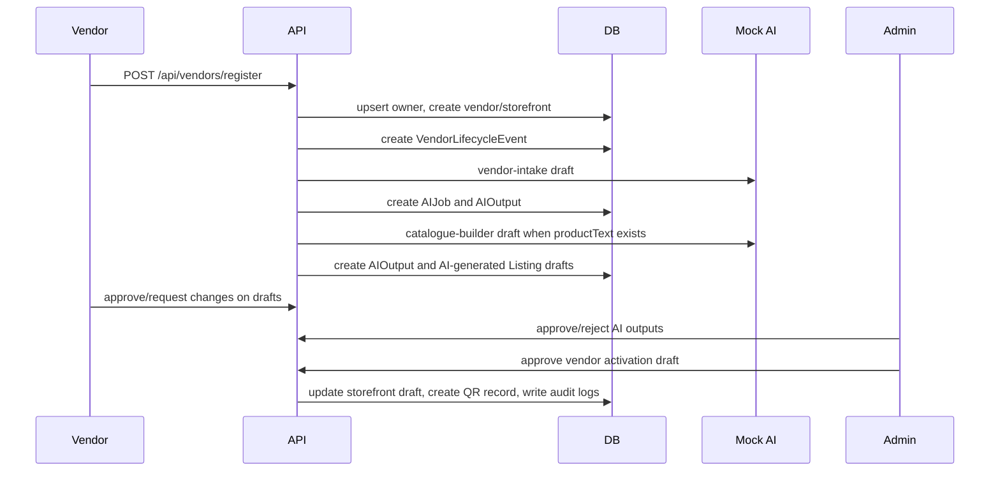
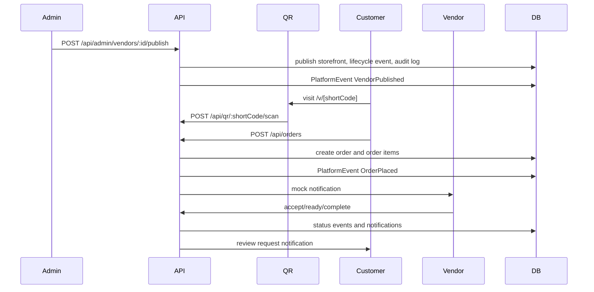
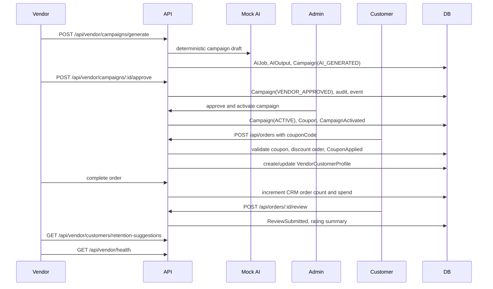

# BuzzyStores Architecture

## Style

BuzzyStores starts as a modular monolith:

- API-first REST boundary
- PostgreSQL-first persistence
- event-driven workflow hooks
- human approval gates for AI and sensitive operations
- strict role-based access control
- provider abstractions for AI, payments, and notifications

The module boundaries in `apps/api/src/modules` are intentionally close to eventual service boundaries. The first implementation should keep shared transactions and local development simple.

## Core Flow

## Approval Policy

AI can create drafts, summarize, translate, classify, and recommend. AI cannot publish listings, approve vendors, refund money, suspend accounts, alter payouts, or make compliance decisions.

## Event Hooks

The foundation has not wired BullMQ yet, but modules should emit durable events for:

- vendor lifecycle changes
- AI job completion
- listing approval/publishing
- QR generation and scan analytics
- order status transitions
- review requests
- payout/refund workflows
- support escalations

Phase 2 should introduce a lightweight event publisher before controllers start accumulating workflow logic.

## Phase 2 Activation Flow

The Phase 2 implementation keeps lifecycle movement explicit:

Admin approval moves the vendor to `PENDING_APPROVAL`. Public storefront publishing remains a separate Phase 3 action so AI-generated content is never exposed before approval and publishing.

## Phase 3 Transaction Flow

The first checkout is deliberately single-vendor pickup only. Payment status is stored as mock metadata, not processed by a provider.

## Phase 4 Growth Flow

Phase 4 keeps campaign publishing human-gated. The public web app receives active campaigns only, and unpublished storefronts still return the safe placeholder. Coupon validation is intentionally simple: vendor ownership, active flag, date window, usage limit, campaign active state, and minimum order amount.

Vendor health is a lightweight operational score, not a financial ledger. It combines published storefront status, approved listings, QR scan count, received/completed orders, cancellation/rejection rate, active campaigns, reviews, repeat customers, and days since last order. The next production pass should harden authentication and replace mock fallbacks with fully authenticated API sessions.
